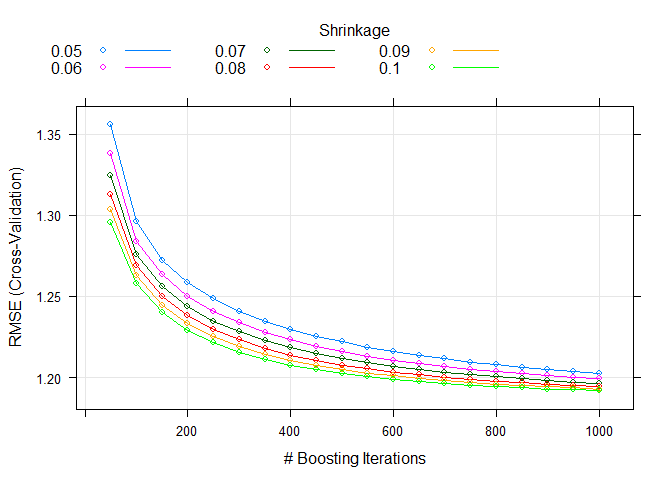

```{r setup, include=FALSE}
devtools::install_github("dgrtwo/gganimate")
list.of.packages <- c("ggplot2", "dplyr", "reshape2", "plotly", "caret", "party", "gbm", "mboost", "corrplot")
new.packages <- list.of.packages[!(list.of.packages %in% installed.packages()[,"Package"])]
if(length(new.packages)) install.packages(new.packages, repos="http://cran.rstudio.com/")
library(plyr)
library(dplyr)
library(ggplot2)
library(gganimate)
library(reshape2)
library(plotly)
library(caret)
library(party)
library(gbm)
library(corrplot)
library(mboost)
lapply(list.of.packages, library, character.only = TRUE)
knitr::opts_chunk$set(echo = FALSE)
theme_set(theme_bw())
```

## Wstêp
Raport przedstawia kroki, pozwalaj¹ce odpowiedzieæ na pytanie co wp³ynê³o na stopniowy spadek d³ugoœci po³awianych œledzi w Europie. Na podstawie zbioru danych z pomiarami rozmiarów œledzi z po³owów z ostatnich 60 lat, wykonano dog³êbn¹ analizê, która pozwala wytypowaæ przyczynê powsta³ego faktu. Po analizie atrybutów oraz ich podstawowych statystyk, zbadano korelacje atrybutów, któr¹ nastêpnie wykorzystano do doboru parametrów do utworzenia regresora. Utworzono model regresji oraz okreœlono wa¿noœæ atrybutów w zbudowanym modelu. Z tak¹ wiedz¹ przyst¹piono do próby udzielenia odpowiedzi na pytanie: "Co by³o przyczyn¹ spadku rozmiaru po³awianych œledzi?".

## Wykorzystane biblioteki
```{r usedLibs}
knitr::kable(list.of.packages)
```

## £adowanie danych
Do wczytania danych z pliku `.csv`, u¿yto funkcji `read.table`. Ze wzglêdu na wyst¹pienie nag³ówka, ustawiono parametr `header = TRUE`, znak separatora zosta³ ustawiony na przecinek (`sep=","`). Dodatkowo skorzystano z parametru `na.strings = "?"` w celu zamiany brakuj¹cych wartoœæi (oznaczonych w zbiorze danych znakiem `'?'`) na wartoœæ `NA`.
```{r loadData, echo=TRUE}
data <- read.table('./sledzie.csv', header = TRUE, sep=",", na.strings = "?")
```

## Rozmiar zbioru
Zbiór danych zawiera `r nrow(data)` wierszy oraz `r length(data) - 1` kolumn.

####Opis kolumn:
* <span style="color:red; font-weight:bold">length</span>: d³ugoœæ z³owionego œledzia [cm];
* cfin1: dostêpnoœæ planktonu [zagêszczenie Calanus finmarchicus gat. 1];
* cfin2: dostêpnoœæ planktonu [zagêszczenie Calanus finmarchicus gat. 2];
* chel1: dostêpnoœæ planktonu [zagêszczenie Calanus helgolandicus gat. 1];
* chel2: dostêpnoœæ planktonu [zagêszczenie Calanus helgolandicus gat. 2];
* lcop1: dostêpnoœæ planktonu [zagêszczenie wid³onogów gat. 1];
* lcop2: dostêpnoœæ planktonu [zagêszczenie wid³onogów gat. 2];
* fbar: natê¿enie po³owów w regionie [u³amek pozostawionego narybku];
* recr: roczny narybek [liczba œledzi];
* cumf: ³¹czne roczne natê¿enie po³owów w regionie [u³amek pozostawionego narybku];
* totaln: ³¹czna liczba ryb z³owionych w ramach po³owu [liczba œledzi];
* sst: temperatura przy powierzchni wody [°C];
* sal: poziom zasolenia wody [Knudsen ppt];
* xmonth: miesi¹c po³owu [numer miesi¹ca];
* nao: oscylacja pó³nocnoatlantycka [mb].


## Przetwarzanie brakuj¹cych danych
Na pocz¹tku sprawdzono liczbê brakuj¹cych wartoœci. W tym celu utworzono data frame z wartoœciami reprezentujacymi liczbê wyst¹pieñ wartoœci `NA` w poszczególych kolumnach.

```{r missingValuesPerColumnHelp, echo=TRUE, eval=FALSE}

missingPerColum = data.frame(
  X = sum(is.na(data$X)), 
  length = sum(is.na(data$length))
  ...
);

```

```{r missingValuesPerColumn, echo=FALSE}
missingPerColum = data.frame(
  X = sum(is.na(data$X)), 
  length = sum(is.na(data$length)), 
  cfin1 = sum(is.na(data$cfin1)), 
  cfin2 = sum(is.na(data$cfin2)), 
  chel1 = sum(is.na(data$chel1)), 
  chel2 = sum(is.na(data$chel2)), 
  lcop1 = sum(is.na(data$lcop1)), 
  lcop2 = sum(is.na(data$lcop2)), 
  fbar = sum(is.na(data$fbar)), 
  recr = sum(is.na(data$recr)), 
  cumf = sum(is.na(data$cumf)), 
  totaln = sum(is.na(data$totaln)), 
  sst = sum(is.na(data$sst)), 
  sal = sum(is.na(data$sal)), 
  xmonth = sum(is.na(data$xmonth)), 
  nao = sum(is.na(data$nao))
);

knitr::kable(missingPerColum)

```

Sprawdzono równie¿ w ilu wierszach wystêpuj¹ brakuj¹ce wartoœci. 
Zbiór danych sk³ada siê z `r nrow(data)` rekordów, gdzie `r nrow(data) - nrow(data %>% na.omit())` z nich zawiera  wartoœci `NA`.
Niestety jest to zbyt du¿a liczba rekordów, aby móc pozwoliæ sobie na proste zignorowanie ich tj. usuniêcie ze zbioru.

Analizuj¹c znaczenie kolumn w których wystêpuj¹ brakuj¹ce wartoœci, mo¿na dojœæ do wniosku, ¿e brakuj¹ce wartoœci mog¹ zostaæ uzupe³nione na podstawie danych pochodz¹cych z tych samych po³owów. Wykorzystano fakt, ¿e sprawdzaj¹c wartoœci z kolumn w których nie wystêpuj¹ wartoœci `NA` czyli: `fbar, recr, totaln, sal, xmonth, nao` z du¿ym prawdopodobieñstwem trafimy na dane z tego samego po³owu. Postanowiono wiêc uzupe³niæ brakuj¹ce dane za pomoc¹ mediany liczonej z rekordów które maj¹ takie same wartoœci w wy¿ej wymienionych kolumnach.


```{r forEachReplaceValues, echo=TRUE, eval=FALSE}
# Pêtla po wszytkich rekordach.
for(i in 1:nrow(data)) {
    row <- data[i,]
    
    # Jeœli brakuj¹ca wartoœæ w kolumnie columnName zast¹p median¹.
      if(is.na(row$columnName)) {
        clearedData$columnName[row$X + 1] = median(data[
			data$fbar == row$fbar & 
			data$recr == row$recr & 
			data$totaln == row$totaln & 
			data$sal == row$sal &
			data$xmonth == row$xmonth &
			data$nao == data$nao,]$columnName, na.rm = TRUE)  
  }
  
  # Analogiczne uzupe³nianie pozosta³ych kolumn.
  ...
  
}
```


```{r missingValuesProcessing, echo=FALSE, CACHE=TRUE}
clearedData <- data #%>% na.omit()
for(i in 1:nrow(data)) {
  #break;
    row <- data[i,]
    
    if(is.na(row$cfin1)) {
      clearedData$cfin1[row$X + 1] = median(data[
    			data$fbar == row$fbar & 
    			data$recr == row$recr & 
    			data$totaln == row$totaln & 
    			data$sal == row$sal &
    			data$xmonth == row$xmonth &
    			data$nao == data$nao,]$cfin1, na.rm = TRUE)  
    }
    
    #cfin2
    if(is.na(row$cfin2)) {
      clearedData$cfin2[row$X + 1] = median(data[
    			data$fbar == row$fbar & 
    			data$recr == row$recr & 
    			data$totaln == row$totaln & 
    			data$sal == row$sal &
    			data$xmonth == row$xmonth &
    			data$nao == data$nao,]$cfin2, na.rm = TRUE)  
    }
    
    #chel1
    if(is.na(row$chel1)) {
      clearedData$chel1[row$X + 1] = median(data[
    			data$fbar == row$fbar & 
    			data$recr == row$recr & 
    			data$totaln == row$totaln & 
    			data$sal == row$sal &
    			data$xmonth == row$xmonth &
    			data$nao == data$nao,]$chel1, na.rm = TRUE)  
    }
    
    #chel2
    if(is.na(row$chel2)) {
      clearedData$chel2[row$X + 1] = median(data[
    			data$fbar == row$fbar & 
    			data$recr == row$recr & 
    			data$totaln == row$totaln & 
    			data$sal == row$sal &
    			data$xmonth == row$xmonth &
    			data$nao == data$nao,]$chel2, na.rm = TRUE)  
    }
    
    
    #lcop1
    if(is.na(row$lcop1)) {
      clearedData$lcop1[row$X + 1] = median(data[
    			data$fbar == row$fbar & 
    			data$recr == row$recr & 
    			data$totaln == row$totaln & 
    			data$sal == row$sal &
    			data$xmonth == row$xmonth &
    			data$nao == data$nao,]$lcop1, na.rm = TRUE)  
    } 
    
        
    #lcop2
    if(is.na(row$lcop2)) {
      clearedData$lcop2[row$X + 1] = median(data[
    			data$fbar == row$fbar & 
    			data$recr == row$recr & 
    			data$totaln == row$totaln & 
    			data$sal == row$sal &
    			data$xmonth == row$xmonth &
    			data$nao == data$nao,]$lcop2, na.rm = TRUE)  
    }    
    
            
    #sst
    if(is.na(row$sst)) {
      clearedData$sst[row$X + 1] = median(data[
    			data$fbar == row$fbar & 
    			data$recr == row$recr & 
    			data$totaln == row$totaln & 
    			data$sal == row$sal &
    			data$xmonth == row$xmonth &
    			data$nao == data$nao,]$sst, na.rm = TRUE)  
    }  
  
}
```

Po tej operacji powtórzono sprawdzenie liczby brakuj¹cych wartoœci dla ka¿dej z kolumn.

```{r missingValuesPerColumnAfterClean, echo=FALSE}
missingValuesPerColumnAfterClean = data.frame(
  X = sum(is.na(clearedData$X)), 
  length = sum(is.na(clearedData$length)), 
  cfin1 = sum(is.na(clearedData$cfin1)), 
  cfin2 = sum(is.na(clearedData$cfin2)), 
  chel1 = sum(is.na(clearedData$chel1)), 
  chel2 = sum(is.na(clearedData$chel2)), 
  lcop1 = sum(is.na(clearedData$lcop1)), 
  lcop2 = sum(is.na(clearedData$lcop2)), 
  fbar = sum(is.na(clearedData$fbar)), 
  recr = sum(is.na(clearedData$recr)), 
  cumf = sum(is.na(clearedData$cumf)), 
  totaln = sum(is.na(clearedData$totaln)), 
  sst = sum(is.na(clearedData$sst)), 
  sal = sum(is.na(clearedData$sal)), 
  xmonth = sum(is.na(clearedData$xmonth)), 
  nao = sum(is.na(clearedData$nao))
);

knitr::kable(missingValuesPerColumnAfterClean)
```

Jak widaæ uda³o siê uzupe³niæ wszystkie brakuj¹ce wartoœci w naszym zbiorze.


## Statystyki

####Statystyki dla zbioru oczyszczonego
```{r statsCleared}
knitr::kable(summary(clearedData %>% select(-c(X, xmonth))))
```

## Rozk³ad wartoœci oraz detekcja outlierów

```{r valueDistribution, message=FALSE}

d <- melt(clearedData %>% select(-X, -xmonth))
ggplot(d,aes(x = value)) + 
    facet_wrap(~variable,scales = "free") + 
    geom_histogram()
```

Analizuj¹c rozk³ady wartoœci poszczególnych atyrybutów oraz bior¹c pod uwagê powy¿sze podsumowanie, mo¿na wywnioskowaæ, ¿e atrybuty `cfin1, cfin2, chel1, chel2, lcop1, lcop2, recr` prawdopobodnie zawieraj¹ wartoœci odstaj¹ce. W celu wyeliminowania outlierów, pos³u¿ono siê metod¹ ([Ÿród³o](http://r-statistics.co/Outlier-Treatment-With-R.html)) sk³adaj¹c¹ siê z nastêpuj¹cych kroków:

1. Wyznaczenie [kwantyli](https://pl.wikipedia.org/wiki/Kwantyl) rzêdu `1/4` oraz `3/4` mo¿na je równie¿ nazwaæ kwartylami.
```{r eval=FALSE, echo=TRUE}
qnt <- quantile(x, probs=c(.25, .75), na.rm = T)
```

Dla przyk³adu kwantyl rzêdu `3/4` jest tak¹ liczb¹ gdzie, `75%` elemntów zbioru ma wartoœæ atrybutu nie wiêksz¹ od tej liczby.
Wyznaczamy zatem dwie liczby, pierwsza której wartoœæ jest niewiêksza ni¿ wartoœæ osi¹gana przez `25%` elementów oraz druga, która jest wartoœci¹ nieprzekraczan¹ przez `75%` rekordów.

2. Nastêpnie wyznaczamy wartoœæ [IQR (ang. interquartile range)](http://sphweb.bumc.bu.edu/otlt/mph-modules/bs/bs704_summarizingdata/bs704_summarizingdata7.html) tj. ró¿nicy miêdzy trzecim a pierwszym kwartylem. Nastêpnie mno¿ymy uzyskan¹ wartoœæ przez pewien wspó³czynnik w naszym przypadku jest to wartoœæ `1.5`.

```{r eval=FALSE, echo=TRUE}
H <- 1.5 * IQR(x, na.rm = T)
```

3. Ostatnim krokiem przygotowawczym jest wyznaczenie kwantyli rzêdu `5/100` oraz `95/100`. Bêd¹ to wartoœci, które wykorzystamy przy zamianie wartoœci odstaj¹cych.

```{r eval=FALSE, echo=TRUE}
caps <- quantile(x, probs=c(.05, .95), na.rm = T)
```

Z tak przygotowanymi danymi mo¿emy przyst¹piæ do operacji wyszukania outlierów i ich zamiany. W zbiorze szukamy wartoœci, których wartosæ jest mniejsza od wartoœci pierwszego kwartyla pomniejszonego o wartoœæ `1.5 * IQR` i zamieniamy j¹ wartoœci¹ kwantyla rzêdu `5/100`. Podobnie postêpujemy z wartoœciami wiêkszymi niz wartoœæ trzeciego kwartyla powiêkszonego o `1.5 * IQR` z t¹ ró¿nic¹, ¿e wartoœæ zamieniamy z wartoœci¹ kwantyla rzêdu `95/100`.

```{r eval=FALSE, echo=TRUE}
clearedData$x[clearedData$x < (qnt[1] - H)] <- caps[1]
clearedData$x[clearedData$x > (qnt[2] + H)] <- caps[2]
```

####Rozk³ady wartoœci atrybutuów wytypowanych do detekcji outlierów.
```{r outliersBefore, message=FALSE}
d <- melt(clearedData %>% select(cfin1, cfin2, chel1, chel2, lcop1, lcop2, recr))
ggplot(d, aes(x = value)) + 
    facet_wrap(~variable,scales = "free") + 
    geom_histogram()
```

```{r outliers}

# cfin1 outliers
x <- clearedData$cfin1;
qnt <- quantile(x, probs=c(.25, .75), na.rm = T)
caps <- quantile(x, probs=c(.05, .95), na.rm = T)
H <- 1.5 * IQR(x, na.rm = T)
clearedData$cfin1[clearedData$cfin1 < (qnt[1] - H)] <- caps[1]
clearedData$cfin1[clearedData$cfin1 > (qnt[2] + H)] <- caps[2]

#cfin2 outliers
x <- clearedData$cfin2;
qnt <- quantile(x, probs=c(.25, .75), na.rm = T)
caps <- quantile(x, probs=c(.05, .95), na.rm = T)
H <- 1.5 * IQR(x, na.rm = T)
clearedData$cfin2[clearedData$cfin2 < (qnt[1] - H)] <- caps[1]
clearedData$cfin2[clearedData$cfin2 > (qnt[2] + H)] <- caps[2]

#chel1 outliers
x <- clearedData$chel1;
qnt <- quantile(x, probs=c(.25, .75), na.rm = T)
caps <- quantile(x, probs=c(.05, .95), na.rm = T)
H <- 1.5 * IQR(x, na.rm = T)
clearedData$chel1[clearedData$chel1 < (qnt[1] - H)] <- caps[1]
clearedData$chel1[clearedData$chel1 > (qnt[2] + H)] <- caps[2]

#chel2 outliers
x <- clearedData$chel2;
qnt <- quantile(x, probs=c(.25, .75), na.rm = T)
caps <- quantile(x, probs=c(.05, .95), na.rm = T)
H <- 1.5 * IQR(x, na.rm = T)
clearedData$chel2[clearedData$chel2 < (qnt[1] - H)] <- caps[1]
clearedData$chel2[clearedData$chel2 > (qnt[2] + H)] <- caps[2]

#lcop1 outliers
x <- clearedData$lcop1;
qnt <- quantile(x, probs=c(.25, .75), na.rm = T)
caps <- quantile(x, probs=c(.05, .95), na.rm = T)
H <- 1.5 * IQR(x, na.rm = T)
clearedData$lcop1[clearedData$lcop1 < (qnt[1] - H)] <- caps[1]
clearedData$lcop1[clearedData$lcop1 > (qnt[2] + H)] <- caps[2]

#lcop2 outliers
x <- clearedData$lcop2;
qnt <- quantile(x, probs=c(.25, .75), na.rm = T)
caps <- quantile(x, probs=c(.05, .95), na.rm = T)
H <- 1.5 * IQR(x, na.rm = T)
clearedData$lcop2[clearedData$lcop2 < (qnt[1] - H)] <- caps[1]
clearedData$lcop2[clearedData$lcop2 > (qnt[2] + H)] <- caps[2]

#recr outliers
x <- clearedData$recr;
qnt <- quantile(x, probs=c(.25, .75), na.rm = T)
caps <- quantile(x, probs=c(.05, .95), na.rm = T)
H <- 1.5 * IQR(x, na.rm = T)
clearedData$recr[clearedData$recr < (qnt[1] - H)] <- caps[1]
clearedData$recr[clearedData$recr > (qnt[2] + H)] <- caps[2]

```

####Rozk³ady wartoœci atrybutuów po zastosowaniu metody do zamiany wartoœci odstaj¹cych.

```{r outliersAfter, message=FALSE}
d <- melt(clearedData %>% select(cfin1, cfin2, chel1, chel2, lcop1, lcop2, recr))
ggplot(d,aes(x = value)) + 
    facet_wrap(~variable,scales = "free") + 
    geom_histogram()
```

## Korelacja miêdzy zmiennymi

Do zbadania korelacji pomiêdzy atrybutami wykorzystano wbudowan¹ funkcjê `cor`, której wynikiem jest macierz z wartoœciami korelacji miêdzy atrybutami. Do wizualizacji uzyskanej macierzy wykorzystano funkcjê `corrplot` z biblioteki [corrplot](https://cran.r-project.org/web/packages/corrplot/vignettes/corrplot-intro.html). Poni¿ej znajduje siê kod u¿yty do wygenerowania wykresu z korelacj¹.
```{r correlation, echo=TRUE}
corMatrix <- round(cor(clearedData %>% select(-X)), 2)

corrplot(corMatrix, type = "lower", order = "hclust", 
         tl.col = "black", tl.srt = 90, method="number", tl.cex = 0.8, diag=FALSE)
```

Z wykresu mo¿na bardzo prosto zauwa¿yæ mocn¹ dodatni¹ korelacjê miêdzy zmiennymi `cumf` i `fbar`, `lcop2` i `chel2`, `lcop1` i `chel1`. Ujemna korelacja jest zauwa¿alna miêdzy atrybutami `totaln` a `cumf`.

Powy¿sza analiza korelacji pomo¿e nam w wyborze atrybutów do u¿ycia w budowania modelu regresji.

## Zmiana rozmiaru œledzia w czasie
Poni¿ej zaprezentowano interaktywny wykres reprezentuj¹cy trend zmiany rozmiaru œledzia w czasie. Do jego wygenerowania u¿ytko biblioteki [plotly](https://plot.ly/r/), która w bardzo prosty sposób daje trochê ¿ycia do wykresów tworzony za pomoc¹ [ggplot](http://ggplot2.org/).
```{r animatedChart, message=FALSE, echo=TRUE}
ggplotly(ggplot(clearedData, aes(x=X, y= length)) + geom_smooth())

```


## Tworzenie modelu regresji
W tej sekcji stworzono model regresji, który pos³u¿y do przewidywania rozmiaru œledzia. Wykorzystano w tym celu algorytm [Stochastic Gradient Boosting](https://github.com/topepo/caret/blob/master/models/files/gbm.R) dostêpny w bibliotece [caret](http://topepo.github.io/caret/index.html). W celu predykcji d³ugoœci œledzia u¿yto wszystkich atrybutów z wyj¹tkiem `cumf, lcop1, lcop2, X`. Dokonano podzia³u na trzy zbiory: treningowy, walidacyjny i testowy. Proporcje wynios³y odpowiednio 60%, 20%, 20%. Do doboru parametrów algorytmu skorzystano z parametru `tuneGrid`. Poni¿ej znajduje siê kod z u¿ytymi parametrami.

```{r labello, eval=FALSE, echo=TRUE}
fitControl <- trainControl(method = 'cv', number = 4, summaryFunction=defaultSummary)
Grid <- expand.grid(n.trees = seq(100,1000,100), interaction.depth = 2, shrinkage = 0.1, n.minobsinnode = 10 )

fit.gbm <- train(formula, data=trainingSet, method = 'gbm', trControl=fitControl,tuneGrid=Grid,metric='RMSE',maximize=FALSE)

```

Wczeœniejsza konfiguracja obiektu `Grid` by³a du¿o bardziej obszerna jednak po uzyskaniu wyniku zosta³y one zmienione w celu szybszego uruchamiania. Poni¿ej wykres z fazy doboru parametrów.


```{r setSplit, echo=FALSE, message=FALSE, warning=FALSE, results='hide'}
# Podzia³ 60%, 20%, 20%
set.seed(23)
inTraining <- createDataPartition(y=clearedData$length, p = .6, list = FALSE);
restSet <- clearedData[-inTraining,]
inTraining2 <- createDataPartition(y=restSet$length, p = .5, list = FALSE);

trainingSet <- clearedData[inTraining,]

validationSet <- restSet[inTraining2,]
testingSet <- restSet[-inTraining2,]

formula <- length ~ xmonth + cfin1 + cfin2 + chel1 + chel2+ fbar + recr + nao + sst + sal + totaln;

fitControl <- trainControl(method = 'cv', number = 4, summaryFunction=defaultSummary)
Grid <- expand.grid(n.trees = seq(100,1000,100), interaction.depth = 2, shrinkage = 0.1, n.minobsinnode = 10 )

fit.gbm <- train(formula, data=trainingSet, method = 'gbm', trControl=fitControl,tuneGrid=Grid,metric='RMSE',maximize=FALSE)
gbmVarImp = varImp(fit.gbm)


# RMSE zbioru walidacyjnego
predict.gbm <- predict(fit.gbm, validationSet)
predict.gbm.validation.summary <- data.frame(obs = validationSet$length, pred = predict.gbm)

# RMSE zbioru testowego
predict.gbm <- predict(fit.gbm, testingSet)
predict.gbm.testing.summary <- data.frame(obs = testingSet$length, pred = predict.gbm)

```

Wartoœci [RMSE](https://en.wikipedia.org/wiki/Root-mean-square_deviation) oraz [wspó³czynnik determinacji](https://pl.wikipedia.org/wiki/Wsp%C3%B3%C5%82czynnik_determinacji) dla predykcji dokonanych na zbiorze walidacyjnym oraz testowym.
```{r predictionsRMSE}
defaultSummary(predict.gbm.validation.summary)
defaultSummary(predict.gbm.testing.summary)

```

Poni¿ej zaprezentowano kilka przyk³adowych predykcji wykonany dla zbioru testowego.
```{r predictions}
idxes <- seq(1000, 8000, 1000)
knitr::kable(data.frame(Oryginalna = testingSet[idxes,]$length, Predykcja = predict.gbm[idxes]))
```

##Ocena wa¿noœci atrybutów
Na koniec warto spojrzeæ na wykres wa¿noœci atrybutów, który pomo¿e nam odpowiedzieæ na pytanie co wp³ynê³o na spadek d³ugoœci œledzia w przeci¹gu ostatnich dekad.

```{r impPlot}
plot(gbmVarImp)
```

Analizuj¹c wykres mo¿emy spróbowaæ u¿yæ stwierdzenia, ¿e na zmianê d³ugoœci ³owionych œledzi w najwiêkszej czêœci wp³yw maj¹ dwa parametry: `sst`(poziom zasolenia wody) oraz `recr` (roczny narybek).

Przedstawmy zatem wykresy jak zmiania³y siê atrybuty `sst` oraz `recr` w czasie. Oraz wykres przedstawiaj¹cy zmiany rozmiaru œledzia w czasie.
```{r lastPlot, message=FALSE}
ggplot(clearedData, aes(x=X, y=sst)) + geom_smooth()
ggplot(clearedData, aes(x=X, y=recr)) + geom_smooth()
ggplot(clearedData, aes(x=X, y=length)) + geom_smooth()
```

##Podsumowanie
Na podstawie powy¿szych wykresów mo¿na stwierdziæ, ¿e rozmiar œledzi rós³ dopóki poziom zasolenia utrzymywa³ siê w granicach 13.75-14, przy rocznym narybku w granicach 50000-60000. W pewnym momencie nast¹pi³ drastyczny spadek rocznego narybku, który mimo póŸniejszego wzrostu w po³¹czeniu ze zwiêkszaj¹cym siê poziomem zasolenia wywo³a³ spadek d³ugoœci po³awianych œledzi.

