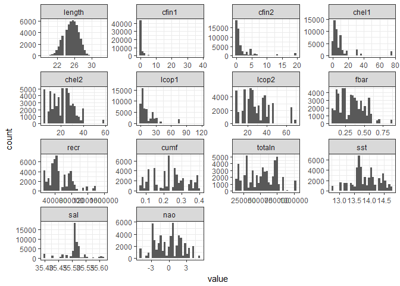
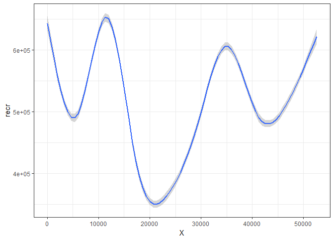

# Zaawansowana eksploracja danych
Krzysztof Chowański (106629)  
15 grudnia 2016  


## Wstęp
Raport przedstawia kroki, pozwalające odpowiedzieć na pytanie co wpłynęło na stopniowy spadek długości poławianych śledzi w Europie. Na podstawie zbioru danych z pomiarami rozmiarów śledzi z połowów z ostatnich 60 lat, wykonano dogłębną analizę, która pozwala wytypować przyczynę powstałego faktu. Po analizie atrybutów oraz ich podstawowych statystyk, zbadano korelacje atrybutów, którą następnie wykorzystano do doboru parametrów do utworzenia regresora. Utworzono model regresji oraz określono ważność atrybutów w zbudowanym modelu. Z taką wiedzą przystąpiono do próby udzielenia odpowiedzi na pytanie: "Co było przyczyną spadku rozmiaru poławianych śledzi?".

## Wykorzystane biblioteki

---------
ggplot2  
dplyr    
reshape2 
plotly   
caret    
party    
gbm      
mboost   
corrplot 
---------

## Ładowanie danych
Do wczytania danych z pliku `.csv`, użyto funkcji `read.table`. Ze względu na wystąpienie nagłówka, ustawiono parametr `header = TRUE`, znak separatora został ustawiony na przecinek (`sep=","`). Dodatkowo skorzystano z parametru `na.strings = "?"` w celu zamiany brakujących wartośći (oznaczonych w zbiorze danych znakiem `'?'`) na wartość `NA`.

```r
data <- read.table('./sledzie.csv', header = TRUE, sep=",", na.strings = "?")
```

## Rozmiar zbioru
Zbiór danych zawiera 52582 wierszy oraz 15 kolumn.

####Opis kolumn:
* <span style="color:red; font-weight:bold">length</span>: długość złowionego śledzia [cm];
* cfin1: dostępność planktonu [zagęszczenie Calanus finmarchicus gat. 1];
* cfin2: dostępność planktonu [zagęszczenie Calanus finmarchicus gat. 2];
* chel1: dostępność planktonu [zagęszczenie Calanus helgolandicus gat. 1];
* chel2: dostępność planktonu [zagęszczenie Calanus helgolandicus gat. 2];
* lcop1: dostępność planktonu [zagęszczenie widłonogów gat. 1];
* lcop2: dostępność planktonu [zagęszczenie widłonogów gat. 2];
* fbar: natężenie połowów w regionie [ułamek pozostawionego narybku];
* recr: roczny narybek [liczba śledzi];
* cumf: łączne roczne natężenie połowów w regionie [ułamek pozostawionego narybku];
* totaln: łączna liczba ryb złowionych w ramach połowu [liczba śledzi];
* sst: temperatura przy powierzchni wody [°C];
* sal: poziom zasolenia wody [Knudsen ppt];
* xmonth: miesiąc połowu [numer miesiąca];
* nao: oscylacja północnoatlantycka [mb].


## Przetwarzanie brakujących danych
Na początku sprawdzono liczbę brakujących wartości. W tym celu utworzono data frame z wartościami reprezentujacymi liczbę wystąpień wartości `NA` w poszczególych kolumnach.


```r
missingPerColum = data.frame(
  X = sum(is.na(data$X)), 
  length = sum(is.na(data$length))
  ...
);
```


  X   length   cfin1   cfin2   chel1   chel2   lcop1   lcop2   fbar   recr   cumf   totaln    sst   sal   xmonth   nao
---  -------  ------  ------  ------  ------  ------  ------  -----  -----  -----  -------  -----  ----  -------  ----
  0        0    1581    1536    1555    1556    1653    1591      0      0      0        0   1584     0        0     0

Sprawdzono również w ilu wierszach występują brakujące wartości. 
Zbiór danych składa się z 52582 rekordów, gdzie 10094 z nich zawiera  wartości `NA`.
Niestety jest to zbyt duża liczba rekordów, aby móc pozwolić sobie na proste zignorowanie ich tj. usunięcie ze zbioru.

Analizując znaczenie kolumn w których występują brakujące wartości, można dojść do wniosku, że brakujące wartości mogą zostać uzupełnione na podstawie danych pochodzących z tych samych połowów. Wykorzystano fakt, że sprawdzając wartości z kolumn w których nie występują wartości `NA` czyli: `fbar, recr, totaln, sal, xmonth, nao` z dużym prawdopodobieństwem trafimy na dane z tego samego połowu. Postanowiono więc uzupełnić brakujące dane za pomocą mediany liczonej z rekordów które mają takie same wartości w wyżej wymienionych kolumnach.


```r
# Pętla po wszytkich rekordach.
for(i in 1:nrow(data)) {
    row <- data[i,]
    
    # Jeśli brakująca wartość w kolumnie columnName zastąp medianą.
      if(is.na(row$columnName)) {
        clearedData$columnName[row$X + 1] = median(data[
			data$fbar == row$fbar & 
			data$recr == row$recr & 
			data$totaln == row$totaln & 
			data$sal == row$sal &
			data$xmonth == row$xmonth &
			data$nao == data$nao,]$columnName, na.rm = TRUE)  
  }
  
  # Analogiczne uzupełnianie pozostałych kolumn.
  ...
  
}
```


Po tej operacji powtórzono sprawdzenie liczby brakujących wartości dla każdej z kolumn.


  X   length   cfin1   cfin2   chel1   chel2   lcop1   lcop2   fbar   recr   cumf   totaln   sst   sal   xmonth   nao
---  -------  ------  ------  ------  ------  ------  ------  -----  -----  -----  -------  ----  ----  -------  ----
  0        0       0       0       0       0       0       0      0      0      0        0     0     0        0     0

Jak widać udało się uzupełnić wszystkie brakujące wartości w naszym zbiorze.


## Statystyki

####Statystyki dla zbioru oczyszczonego

         length         cfin1             cfin2             chel1            chel2            lcop1              lcop2             fbar             recr              cumf             totaln             sst             sal             nao         
---  -------------  ----------------  ----------------  ---------------  ---------------  -----------------  ---------------  ---------------  ----------------  ----------------  ----------------  --------------  --------------  -----------------
     Min.   :19.0   Min.   : 0.0000   Min.   : 0.0000   Min.   : 0.000   Min.   : 5.238   Min.   :  0.3074   Min.   : 7.849   Min.   :0.0680   Min.   : 140515   Min.   :0.06833   Min.   : 144137   Min.   :12.77   Min.   :35.40   Min.   :-4.89000 
     1st Qu.:24.0   1st Qu.: 0.0000   1st Qu.: 0.2778   1st Qu.: 2.469   1st Qu.:13.427   1st Qu.:  2.5479   1st Qu.:17.808   1st Qu.:0.2270   1st Qu.: 360061   1st Qu.:0.14809   1st Qu.: 306068   1st Qu.:13.60   1st Qu.:35.51   1st Qu.:-1.89000 
     Median :25.5   Median : 0.1111   Median : 0.7012   Median : 5.750   Median :21.435   Median :  7.0000   Median :24.859   Median :0.3320   Median : 421391   Median :0.23191   Median : 539558   Median :13.86   Median :35.51   Median : 0.20000 
     Mean   :25.3   Mean   : 0.4440   Mean   : 2.0257   Mean   : 9.994   Mean   :21.219   Mean   : 12.7967   Mean   :28.422   Mean   :0.3304   Mean   : 520367   Mean   :0.22981   Mean   : 514973   Mean   :13.87   Mean   :35.51   Mean   :-0.09236 
     3rd Qu.:26.5   3rd Qu.: 0.3333   3rd Qu.: 1.7936   3rd Qu.:11.500   3rd Qu.:27.193   3rd Qu.: 21.2315   3rd Qu.:37.232   3rd Qu.:0.4560   3rd Qu.: 724151   3rd Qu.:0.29803   3rd Qu.: 730351   3rd Qu.:14.16   3rd Qu.:35.52   3rd Qu.: 1.63000 
     Max.   :32.5   Max.   :37.6667   Max.   :19.3958   Max.   :75.000   Max.   :57.706   Max.   :115.5833   Max.   :68.736   Max.   :0.8490   Max.   :1565890   Max.   :0.39801   Max.   :1015595   Max.   :14.73   Max.   :35.61   Max.   : 5.08000 

## Rozkład wartości oraz detekcja outlierów

<!-- -->

Analizując rozkłady wartości poszczególnych atyrybutów oraz biorąc pod uwagę powyższe podsumowanie, można wywnioskować, że atrybuty `cfin1, cfin2, chel1, chel2, lcop1, lcop2, recr` prawdopobodnie zawierają wartości odstające. W celu wyeliminowania outlierów, posłużono się metodą ([źródło](http://r-statistics.co/Outlier-Treatment-With-R.html)) składającą się z następujących kroków:

1. Wyznaczenie [kwantyli](https://pl.wikipedia.org/wiki/Kwantyl) rzędu `1/4` oraz `3/4` można je również nazwać kwartylami.

```r
qnt <- quantile(x, probs=c(.25, .75), na.rm = T)
```

Dla przykładu kwantyl rzędu `3/4` jest taką liczbą gdzie, `75%` elemntów zbioru ma wartość atrybutu nie większą od tej liczby.
Wyznaczamy zatem dwie liczby, pierwsza której wartość jest niewiększa niż wartość osiągana przez `25%` elementów oraz druga, która jest wartością nieprzekraczaną przez `75%` rekordów.

2. Następnie wyznaczamy wartość [IQR (ang. interquartile range)](http://sphweb.bumc.bu.edu/otlt/mph-modules/bs/bs704_summarizingdata/bs704_summarizingdata7.html) tj. różnicy między trzecim a pierwszym kwartylem. Następnie mnożymy uzyskaną wartość przez pewien współczynnik w naszym przypadku jest to wartość `1.5`.


```r
H <- 1.5 * IQR(x, na.rm = T)
```

3. Ostatnim krokiem przygotowawczym jest wyznaczenie kwantyli rzędu `5/100` oraz `95/100`. Będą to wartości, które wykorzystamy przy zamianie wartości odstających.


```r
caps <- quantile(x, probs=c(.05, .95), na.rm = T)
```

Z tak przygotowanymi danymi możemy przystąpić do operacji wyszukania outlierów i ich zamiany. W zbiorze szukamy wartości, których wartosć jest mniejsza od wartości pierwszego kwartyla pomniejszonego o wartość `1.5 * IQR` i zamieniamy ją wartością kwantyla rzędu `5/100`. Podobnie postępujemy z wartościami większymi niz wartość trzeciego kwartyla powiększonego o `1.5 * IQR` z tą różnicą, że wartość zamieniamy z wartością kwantyla rzędu `95/100`.


```r
clearedData$x[clearedData$x < (qnt[1] - H)] <- caps[1]
clearedData$x[clearedData$x > (qnt[2] + H)] <- caps[2]
```

####Rozkłady wartości atrybutuów wytypowanych do detekcji outlierów.
<!-- -->


####Rozkłady wartości atrybutuów po zastosowaniu metody do zamiany wartości odstających.

<!-- -->

## Korelacja między zmiennymi

Do zbadania korelacji pomiędzy atrybutami wykorzystano wbudowaną funkcję `cor`, której wynikiem jest macierz z wartościami korelacji między atrybutami. Do wizualizacji uzyskanej macierzy wykorzystano funkcję `corrplot` z biblioteki [corrplot](https://cran.r-project.org/web/packages/corrplot/vignettes/corrplot-intro.html). Poniżej znajduje się kod użyty do wygenerowania wykresu z korelacją.

```r
corMatrix <- round(cor(clearedData %>% select(-X)), 2)

corrplot(corMatrix, type = "lower", order = "hclust", 
         tl.col = "black", tl.srt = 90, method="number", tl.cex = 0.8, diag=FALSE)
```

<!-- -->

Z wykresu można bardzo prosto zauważyć mocną dodatnią korelację między zmiennymi `cumf` i `fbar`, `lcop2` i `chel2`, `lcop1` i `chel1`. Ujemna korelacja jest zauważalna między atrybutami `totaln` a `cumf`.

Powyższa analiza korelacji pomoże nam w wyborze atrybutów do użycia w budowania modelu regresji.

## Zmiana rozmiaru śledzia w czasie
Poniżej zaprezentowano interaktywny wykres reprezentujący trend zmiany rozmiaru śledzia w czasie. Do jego wygenerowania użytko biblioteki [plotly](https://plot.ly/r/), która w bardzo prosty sposób daje trochę życia do wykresów tworzony za pomocą [ggplot](http://ggplot2.org/).

```r
ggplotly(ggplot(clearedData, aes(x=X, y= length)) + geom_smooth())
```

<!--html_preserve--><div id="htmlwidget-092a75a9291916f54d73" style="width:672px;height:480px;" class="plotly html-widget"></div>
<script type="application/json" data-for="htmlwidget-092a75a9291916f54d73">{"x":{"data":[{"x":[0,665.582278481013,1331.16455696203,1996.74683544304,2662.32911392405,3327.91139240506,3993.49367088608,4659.07594936709,5324.6582278481,5990.24050632911,6655.82278481013,7321.40506329114,7986.98734177215,8652.56962025316,9318.15189873418,9983.73417721519,10649.3164556962,11314.8987341772,11980.4810126582,12646.0632911392,13311.6455696203,13977.2278481013,14642.8101265823,15308.3924050633,15973.9746835443,16639.5569620253,17305.1392405063,17970.7215189873,18636.3037974684,19301.8860759494,19967.4683544304,20633.0506329114,21298.6329113924,21964.2151898734,22629.7974683544,23295.3797468354,23960.9620253165,24626.5443037975,25292.1265822785,25957.7088607595,26623.2911392405,27288.8734177215,27954.4556962025,28620.0379746835,29285.6202531646,29951.2025316456,30616.7848101266,31282.3670886076,31947.9493670886,32613.5316455696,33279.1139240506,33944.6962025316,34610.2784810127,35275.8607594937,35941.4430379747,36607.0253164557,37272.6075949367,37938.1898734177,38603.7721518987,39269.3544303797,39934.9367088608,40600.5189873418,41266.1012658228,41931.6835443038,42597.2658227848,43262.8481012658,43928.4303797468,44594.0126582278,45259.5949367089,45925.1772151899,46590.7594936709,47256.3417721519,47921.9240506329,48587.5063291139,49253.0886075949,49918.6708860759,50584.253164557,51249.835443038,51915.417721519,52581],"y":[24.3992315080778,24.5291695130141,24.6580145649872,24.7846737110339,24.9080539981911,25.0270624734954,25.1406061839839,25.2475921766931,25.34692749866,25.437526041801,25.5194131353754,25.5949447901831,25.6667704912415,25.737539723568,25.8099019721802,25.8865067220954,25.9700034583312,26.0630416659048,26.168131928154,26.2835722009096,26.4027901998548,26.51894234833,26.6251850696753,26.7146747872309,26.780567924337,26.8160209043336,26.8141901505611,26.7690500740793,26.6840841931912,26.5689109340982,26.4332509714667,26.2868249799631,26.139353634254,26.0005576090058,25.8801575788848,25.7878742185575,25.7314065211486,25.7071407500615,25.7075303663256,25.7250248823732,25.7520738106369,25.7811266635492,25.8046329535424,25.8150421930491,25.8048066306038,25.7691036724492,25.7109496573914,25.6347618085204,25.5449573489258,25.4459535016977,25.3421674899257,25.2380165366998,25.1379178651098,25.0462492015808,24.9650184726597,24.892560415082,24.8268937922657,24.7660373676291,24.7080099045905,24.6508301665681,24.5925169169802,24.5310889192449,24.464686109255,24.393623711165,24.320098515313,24.246369352344,24.1746950529031,24.1073344476353,24.0465463671856,23.9945896421992,23.953723103321,23.9259047080662,23.9107029725339,23.9065469545268,23.9118586943984,23.9250602325023,23.944573609192,23.968820864821,23.9962240397429,24.0252051743113],"text":["X: 0<br>length: 24.4","X: 665.58<br>length: 24.53","X: 1331.16<br>length: 24.66","X: 1996.75<br>length: 24.78","X: 2662.33<br>length: 24.91","X: 3327.91<br>length: 25.03","X: 3993.49<br>length: 25.14","X: 4659.08<br>length: 25.25","X: 5324.66<br>length: 25.35","X: 5990.24<br>length: 25.44","X: 6655.82<br>length: 25.52","X: 7321.41<br>length: 25.59","X: 7986.99<br>length: 25.67","X: 8652.57<br>length: 25.74","X: 9318.15<br>length: 25.81","X: 9983.73<br>length: 25.89","X: 10649.32<br>length: 25.97","X: 11314.9<br>length: 26.06","X: 11980.48<br>length: 26.17","X: 12646.06<br>length: 26.28","X: 13311.65<br>length: 26.4","X: 13977.23<br>length: 26.52","X: 14642.81<br>length: 26.63","X: 15308.39<br>length: 26.71","X: 15973.97<br>length: 26.78","X: 16639.56<br>length: 26.82","X: 17305.14<br>length: 26.81","X: 17970.72<br>length: 26.77","X: 18636.3<br>length: 26.68","X: 19301.89<br>length: 26.57","X: 19967.47<br>length: 26.43","X: 20633.05<br>length: 26.29","X: 21298.63<br>length: 26.14","X: 21964.22<br>length: 26","X: 22629.8<br>length: 25.88","X: 23295.38<br>length: 25.79","X: 23960.96<br>length: 25.73","X: 24626.54<br>length: 25.71","X: 25292.13<br>length: 25.71","X: 25957.71<br>length: 25.73","X: 26623.29<br>length: 25.75","X: 27288.87<br>length: 25.78","X: 27954.46<br>length: 25.8","X: 28620.04<br>length: 25.82","X: 29285.62<br>length: 25.8","X: 29951.2<br>length: 25.77","X: 30616.78<br>length: 25.71","X: 31282.37<br>length: 25.63","X: 31947.95<br>length: 25.54","X: 32613.53<br>length: 25.45","X: 33279.11<br>length: 25.34","X: 33944.7<br>length: 25.24","X: 34610.28<br>length: 25.14","X: 35275.86<br>length: 25.05","X: 35941.44<br>length: 24.97","X: 36607.03<br>length: 24.89","X: 37272.61<br>length: 24.83","X: 37938.19<br>length: 24.77","X: 38603.77<br>length: 24.71","X: 39269.35<br>length: 24.65","X: 39934.94<br>length: 24.59","X: 40600.52<br>length: 24.53","X: 41266.1<br>length: 24.46","X: 41931.68<br>length: 24.39","X: 42597.27<br>length: 24.32","X: 43262.85<br>length: 24.25","X: 43928.43<br>length: 24.17","X: 44594.01<br>length: 24.11","X: 45259.59<br>length: 24.05","X: 45925.18<br>length: 23.99","X: 46590.76<br>length: 23.95","X: 47256.34<br>length: 23.93","X: 47921.92<br>length: 23.91","X: 48587.51<br>length: 23.91","X: 49253.09<br>length: 23.91","X: 49918.67<br>length: 23.93","X: 50584.25<br>length: 23.94","X: 51249.84<br>length: 23.97","X: 51915.42<br>length: 24","X: 52581<br>length: 24.03"],"key":null,"type":"scatter","mode":"lines","name":"fitted values","line":{"width":3.77952755905512,"color":"rgba(51,102,255,1)","dash":"solid"},"hoveron":"points","showlegend":false,"xaxis":"x","yaxis":"y","hoverinfo":"text"},{"x":[0,665.582278481013,1331.16455696203,1996.74683544304,2662.32911392405,3327.91139240506,3993.49367088608,4659.07594936709,5324.6582278481,5990.24050632911,6655.82278481013,7321.40506329114,7986.98734177215,8652.56962025316,9318.15189873418,9983.73417721519,10649.3164556962,11314.8987341772,11980.4810126582,12646.0632911392,13311.6455696203,13977.2278481013,14642.8101265823,15308.3924050633,15973.9746835443,16639.5569620253,17305.1392405063,17970.7215189873,18636.3037974684,19301.8860759494,19967.4683544304,20633.0506329114,21298.6329113924,21964.2151898734,22629.7974683544,23295.3797468354,23960.9620253165,24626.5443037975,25292.1265822785,25957.7088607595,26623.2911392405,27288.8734177215,27954.4556962025,28620.0379746835,29285.6202531646,29951.2025316456,30616.7848101266,31282.3670886076,31947.9493670886,32613.5316455696,33279.1139240506,33944.6962025316,34610.2784810127,35275.8607594937,35941.4430379747,36607.0253164557,37272.6075949367,37938.1898734177,38603.7721518987,39269.3544303797,39934.9367088608,40600.5189873418,41266.1012658228,41931.6835443038,42597.2658227848,43262.8481012658,43928.4303797468,44594.0126582278,45259.5949367089,45925.1772151899,46590.7594936709,47256.3417721519,47921.9240506329,48587.5063291139,49253.0886075949,49918.6708860759,50584.253164557,51249.835443038,51915.417721519,52581,52581,52581,51915.417721519,51249.835443038,50584.253164557,49918.6708860759,49253.0886075949,48587.5063291139,47921.9240506329,47256.3417721519,46590.7594936709,45925.1772151899,45259.5949367089,44594.0126582278,43928.4303797468,43262.8481012658,42597.2658227848,41931.6835443038,41266.1012658228,40600.5189873418,39934.9367088608,39269.3544303797,38603.7721518987,37938.1898734177,37272.6075949367,36607.0253164557,35941.4430379747,35275.8607594937,34610.2784810127,33944.6962025316,33279.1139240506,32613.5316455696,31947.9493670886,31282.3670886076,30616.7848101266,29951.2025316456,29285.6202531646,28620.0379746835,27954.4556962025,27288.8734177215,26623.2911392405,25957.7088607595,25292.1265822785,24626.5443037975,23960.9620253165,23295.3797468354,22629.7974683544,21964.2151898734,21298.6329113924,20633.0506329114,19967.4683544304,19301.8860759494,18636.3037974684,17970.7215189873,17305.1392405063,16639.5569620253,15973.9746835443,15308.3924050633,14642.8101265823,13977.2278481013,13311.6455696203,12646.0632911392,11980.4810126582,11314.8987341772,10649.3164556962,9983.73417721519,9318.15189873418,8652.56962025316,7986.98734177215,7321.40506329114,6655.82278481013,5990.24050632911,5324.6582278481,4659.07594936709,3993.49367088608,3327.91139240506,2662.32911392405,1996.74683544304,1331.16455696203,665.582278481013,0,0],"y":[24.3267572614693,24.4694144173589,24.6094261727919,24.7446867415255,24.8730725185675,24.9932429141026,25.1052771170574,25.2099174111257,25.307560913968,25.3980255609111,25.4814740743594,25.5594773227311,25.6335951380404,25.705423330634,25.7770946406164,25.8516325066158,25.9326907901676,26.0240323448498,26.1290560693297,26.2461050885989,26.3677303697169,26.4859672918042,26.5929561317124,26.6814637429857,26.7451542865894,26.7782433008728,26.7749895069232,26.7301708303241,26.6470639783324,26.5343260299747,26.4005421128618,26.2545012055366,26.1057212324086,25.9645933349922,25.8419458258615,25.74856996041,25.6928219085671,25.6706339701544,25.673435440602,25.692543357869,25.7195922861327,25.7470317378237,25.7681261736266,25.7764575804466,25.7655023724179,25.730891919367,25.6749853832995,25.6011294065835,25.5126335744066,25.4132446430102,25.3075825857324,25.2009963217769,25.0990386212849,25.00704855786,24.9272408691099,24.8571467772711,24.7936827480366,24.7338084298149,24.6750348483581,24.6157703368243,24.5550498050864,24.4920130607714,24.4256767883961,24.3563110429851,24.2852242996068,24.213562020416,24.142578659594,24.074159094157,24.011078899572,23.9566505810656,23.9142226222466,23.8865381230361,23.8730282065172,23.8712178873297,23.8780391355504,23.890078755065,23.9045866440048,23.9202324790763,23.9364689524828,23.9527309378781,23.9527309378781,24.0976794107445,24.055979127003,24.0174092505656,23.9845605743791,23.9600417099395,23.9456782532465,23.9418760217239,23.9483777385506,23.9652712930962,23.9932235843953,24.0325287033327,24.0820138347993,24.1405098011136,24.2068114462122,24.2791766842721,24.3549727310193,24.430936379345,24.503695430114,24.5701647777184,24.6299840288739,24.6858899963119,24.7409849608229,24.7982663054433,24.8601048364947,24.9279740528928,25.0027960762096,25.0854498453017,25.1767971089346,25.2750367516227,25.3767523941191,25.4786623603852,25.5772811234451,25.6683942104573,25.7469139314834,25.8073154255314,25.8441108887897,25.8536268056515,25.8411397334582,25.8152215892746,25.7845553351411,25.7575064068775,25.7416252920492,25.7436475299687,25.76999113373,25.827178476705,25.918369331908,26.0365218830193,26.1729860360995,26.3191487543897,26.4659598300716,26.6034958382217,26.72110440805,26.8079293178346,26.853390794199,26.8537985077944,26.8159815620845,26.7478858314761,26.6574140076383,26.5519174048558,26.4378500299928,26.3210393132202,26.2072077869784,26.1020509869599,26.0073161264947,25.9213809375751,25.8427093037441,25.7696561165021,25.6999458444426,25.6304122576351,25.5573521963914,25.477026522691,25.386294083352,25.2852669422605,25.1759352509103,25.0608820328883,24.9430354778147,24.8246606805424,24.7066029571825,24.5889246086693,24.4717057546863,24.3267572614693],"text":["X: 0<br>length: 24.4","X: 665.58<br>length: 24.53","X: 1331.16<br>length: 24.66","X: 1996.75<br>length: 24.78","X: 2662.33<br>length: 24.91","X: 3327.91<br>length: 25.03","X: 3993.49<br>length: 25.14","X: 4659.08<br>length: 25.25","X: 5324.66<br>length: 25.35","X: 5990.24<br>length: 25.44","X: 6655.82<br>length: 25.52","X: 7321.41<br>length: 25.59","X: 7986.99<br>length: 25.67","X: 8652.57<br>length: 25.74","X: 9318.15<br>length: 25.81","X: 9983.73<br>length: 25.89","X: 10649.32<br>length: 25.97","X: 11314.9<br>length: 26.06","X: 11980.48<br>length: 26.17","X: 12646.06<br>length: 26.28","X: 13311.65<br>length: 26.4","X: 13977.23<br>length: 26.52","X: 14642.81<br>length: 26.63","X: 15308.39<br>length: 26.71","X: 15973.97<br>length: 26.78","X: 16639.56<br>length: 26.82","X: 17305.14<br>length: 26.81","X: 17970.72<br>length: 26.77","X: 18636.3<br>length: 26.68","X: 19301.89<br>length: 26.57","X: 19967.47<br>length: 26.43","X: 20633.05<br>length: 26.29","X: 21298.63<br>length: 26.14","X: 21964.22<br>length: 26","X: 22629.8<br>length: 25.88","X: 23295.38<br>length: 25.79","X: 23960.96<br>length: 25.73","X: 24626.54<br>length: 25.71","X: 25292.13<br>length: 25.71","X: 25957.71<br>length: 25.73","X: 26623.29<br>length: 25.75","X: 27288.87<br>length: 25.78","X: 27954.46<br>length: 25.8","X: 28620.04<br>length: 25.82","X: 29285.62<br>length: 25.8","X: 29951.2<br>length: 25.77","X: 30616.78<br>length: 25.71","X: 31282.37<br>length: 25.63","X: 31947.95<br>length: 25.54","X: 32613.53<br>length: 25.45","X: 33279.11<br>length: 25.34","X: 33944.7<br>length: 25.24","X: 34610.28<br>length: 25.14","X: 35275.86<br>length: 25.05","X: 35941.44<br>length: 24.97","X: 36607.03<br>length: 24.89","X: 37272.61<br>length: 24.83","X: 37938.19<br>length: 24.77","X: 38603.77<br>length: 24.71","X: 39269.35<br>length: 24.65","X: 39934.94<br>length: 24.59","X: 40600.52<br>length: 24.53","X: 41266.1<br>length: 24.46","X: 41931.68<br>length: 24.39","X: 42597.27<br>length: 24.32","X: 43262.85<br>length: 24.25","X: 43928.43<br>length: 24.17","X: 44594.01<br>length: 24.11","X: 45259.59<br>length: 24.05","X: 45925.18<br>length: 23.99","X: 46590.76<br>length: 23.95","X: 47256.34<br>length: 23.93","X: 47921.92<br>length: 23.91","X: 48587.51<br>length: 23.91","X: 49253.09<br>length: 23.91","X: 49918.67<br>length: 23.93","X: 50584.25<br>length: 23.94","X: 51249.84<br>length: 23.97","X: 51915.42<br>length: 24","X: 52581<br>length: 24.03","X: 52581<br>length: 24.03","X: 52581<br>length: 24.03","X: 51915.42<br>length: 24","X: 51249.84<br>length: 23.97","X: 50584.25<br>length: 23.94","X: 49918.67<br>length: 23.93","X: 49253.09<br>length: 23.91","X: 48587.51<br>length: 23.91","X: 47921.92<br>length: 23.91","X: 47256.34<br>length: 23.93","X: 46590.76<br>length: 23.95","X: 45925.18<br>length: 23.99","X: 45259.59<br>length: 24.05","X: 44594.01<br>length: 24.11","X: 43928.43<br>length: 24.17","X: 43262.85<br>length: 24.25","X: 42597.27<br>length: 24.32","X: 41931.68<br>length: 24.39","X: 41266.1<br>length: 24.46","X: 40600.52<br>length: 24.53","X: 39934.94<br>length: 24.59","X: 39269.35<br>length: 24.65","X: 38603.77<br>length: 24.71","X: 37938.19<br>length: 24.77","X: 37272.61<br>length: 24.83","X: 36607.03<br>length: 24.89","X: 35941.44<br>length: 24.97","X: 35275.86<br>length: 25.05","X: 34610.28<br>length: 25.14","X: 33944.7<br>length: 25.24","X: 33279.11<br>length: 25.34","X: 32613.53<br>length: 25.45","X: 31947.95<br>length: 25.54","X: 31282.37<br>length: 25.63","X: 30616.78<br>length: 25.71","X: 29951.2<br>length: 25.77","X: 29285.62<br>length: 25.8","X: 28620.04<br>length: 25.82","X: 27954.46<br>length: 25.8","X: 27288.87<br>length: 25.78","X: 26623.29<br>length: 25.75","X: 25957.71<br>length: 25.73","X: 25292.13<br>length: 25.71","X: 24626.54<br>length: 25.71","X: 23960.96<br>length: 25.73","X: 23295.38<br>length: 25.79","X: 22629.8<br>length: 25.88","X: 21964.22<br>length: 26","X: 21298.63<br>length: 26.14","X: 20633.05<br>length: 26.29","X: 19967.47<br>length: 26.43","X: 19301.89<br>length: 26.57","X: 18636.3<br>length: 26.68","X: 17970.72<br>length: 26.77","X: 17305.14<br>length: 26.81","X: 16639.56<br>length: 26.82","X: 15973.97<br>length: 26.78","X: 15308.39<br>length: 26.71","X: 14642.81<br>length: 26.63","X: 13977.23<br>length: 26.52","X: 13311.65<br>length: 26.4","X: 12646.06<br>length: 26.28","X: 11980.48<br>length: 26.17","X: 11314.9<br>length: 26.06","X: 10649.32<br>length: 25.97","X: 9983.73<br>length: 25.89","X: 9318.15<br>length: 25.81","X: 8652.57<br>length: 25.74","X: 7986.99<br>length: 25.67","X: 7321.41<br>length: 25.59","X: 6655.82<br>length: 25.52","X: 5990.24<br>length: 25.44","X: 5324.66<br>length: 25.35","X: 4659.08<br>length: 25.25","X: 3993.49<br>length: 25.14","X: 3327.91<br>length: 25.03","X: 2662.33<br>length: 24.91","X: 1996.75<br>length: 24.78","X: 1331.16<br>length: 24.66","X: 665.58<br>length: 24.53","X: 0<br>length: 24.4","X: 0<br>length: 24.4"],"key":null,"type":"scatter","mode":"lines","line":{"width":3.77952755905512,"color":"transparent","dash":"solid"},"fill":"toself","fillcolor":"rgba(153,153,153,0.4)","hoveron":"points","hoverinfo":"x+y","showlegend":false,"xaxis":"x","yaxis":"y","name":""}],"layout":{"margin":{"t":26.2283105022831,"r":7.30593607305936,"b":40.1826484018265,"l":37.2602739726027},"plot_bgcolor":"rgba(255,255,255,1)","paper_bgcolor":"rgba(255,255,255,1)","font":{"color":"rgba(0,0,0,1)","family":"","size":14.6118721461187},"xaxis":{"domain":[0,1],"type":"linear","autorange":false,"tickmode":"array","range":[-2629.05,55210.05],"ticktext":["0","10000","20000","30000","40000","50000"],"tickvals":[0,10000,20000,30000,40000,50000],"ticks":"outside","tickcolor":"rgba(51,51,51,1)","ticklen":3.65296803652968,"tickwidth":0.66417600664176,"showticklabels":true,"tickfont":{"color":"rgba(77,77,77,1)","family":"","size":11.689497716895},"tickangle":-0,"showline":false,"linecolor":null,"linewidth":0,"showgrid":true,"gridcolor":"rgba(235,235,235,1)","gridwidth":0.66417600664176,"zeroline":false,"anchor":"y","title":"X","titlefont":{"color":"rgba(0,0,0,1)","family":"","size":14.6118721461187},"hoverformat":".2f"},"yaxis":{"domain":[0,1],"type":"linear","autorange":false,"tickmode":"array","range":[23.7220888563065,27.0029275388176],"ticktext":["24","25","26","27"],"tickvals":[24,25,26,27],"ticks":"outside","tickcolor":"rgba(51,51,51,1)","ticklen":3.65296803652968,"tickwidth":0.66417600664176,"showticklabels":true,"tickfont":{"color":"rgba(77,77,77,1)","family":"","size":11.689497716895},"tickangle":-0,"showline":false,"linecolor":null,"linewidth":0,"showgrid":true,"gridcolor":"rgba(235,235,235,1)","gridwidth":0.66417600664176,"zeroline":false,"anchor":"x","title":"length","titlefont":{"color":"rgba(0,0,0,1)","family":"","size":14.6118721461187},"hoverformat":".2f"},"shapes":[{"type":"rect","fillcolor":"transparent","line":{"color":"rgba(51,51,51,1)","width":0.66417600664176,"linetype":"solid"},"yref":"paper","xref":"paper","x0":0,"x1":1,"y0":0,"y1":1}],"showlegend":false,"legend":{"bgcolor":"rgba(255,255,255,1)","bordercolor":"transparent","borderwidth":1.88976377952756,"font":{"color":"rgba(0,0,0,1)","family":"","size":11.689497716895}},"hovermode":"closest"},"source":"A","config":{"modeBarButtonsToAdd":[{"name":"Collaborate","icon":{"width":1000,"ascent":500,"descent":-50,"path":"M487 375c7-10 9-23 5-36l-79-259c-3-12-11-23-22-31-11-8-22-12-35-12l-263 0c-15 0-29 5-43 15-13 10-23 23-28 37-5 13-5 25-1 37 0 0 0 3 1 7 1 5 1 8 1 11 0 2 0 4-1 6 0 3-1 5-1 6 1 2 2 4 3 6 1 2 2 4 4 6 2 3 4 5 5 7 5 7 9 16 13 26 4 10 7 19 9 26 0 2 0 5 0 9-1 4-1 6 0 8 0 2 2 5 4 8 3 3 5 5 5 7 4 6 8 15 12 26 4 11 7 19 7 26 1 1 0 4 0 9-1 4-1 7 0 8 1 2 3 5 6 8 4 4 6 6 6 7 4 5 8 13 13 24 4 11 7 20 7 28 1 1 0 4 0 7-1 3-1 6-1 7 0 2 1 4 3 6 1 1 3 4 5 6 2 3 3 5 5 6 1 2 3 5 4 9 2 3 3 7 5 10 1 3 2 6 4 10 2 4 4 7 6 9 2 3 4 5 7 7 3 2 7 3 11 3 3 0 8 0 13-1l0-1c7 2 12 2 14 2l218 0c14 0 25-5 32-16 8-10 10-23 6-37l-79-259c-7-22-13-37-20-43-7-7-19-10-37-10l-248 0c-5 0-9-2-11-5-2-3-2-7 0-12 4-13 18-20 41-20l264 0c5 0 10 2 16 5 5 3 8 6 10 11l85 282c2 5 2 10 2 17 7-3 13-7 17-13z m-304 0c-1-3-1-5 0-7 1-1 3-2 6-2l174 0c2 0 4 1 7 2 2 2 4 4 5 7l6 18c0 3 0 5-1 7-1 1-3 2-6 2l-173 0c-3 0-5-1-8-2-2-2-4-4-4-7z m-24-73c-1-3-1-5 0-7 2-2 3-2 6-2l174 0c2 0 5 0 7 2 3 2 4 4 5 7l6 18c1 2 0 5-1 6-1 2-3 3-5 3l-174 0c-3 0-5-1-7-3-3-1-4-4-5-6z"},"click":"function(gd) { \n        // is this being viewed in RStudio?\n        if (location.search == '?viewer_pane=1') {\n          alert('To learn about plotly for collaboration, visit:\\n https://cpsievert.github.io/plotly_book/plot-ly-for-collaboration.html');\n        } else {\n          window.open('https://cpsievert.github.io/plotly_book/plot-ly-for-collaboration.html', '_blank');\n        }\n      }"}],"modeBarButtonsToRemove":["sendDataToCloud"]},"base_url":"https://plot.ly"},"evals":["config.modeBarButtonsToAdd.0.click"],"jsHooks":[]}</script><!--/html_preserve-->


## Tworzenie modelu regresji
W tej sekcji stworzono model regresji, który posłuży do przewidywania rozmiaru śledzia. Wykorzystano w tym celu algorytm [Stochastic Gradient Boosting](https://github.com/topepo/caret/blob/master/models/files/gbm.R) dostępny w bibliotece [caret](http://topepo.github.io/caret/index.html). W celu predykcji długości śledzia użyto wszystkich atrybutów z wyjątkiem `cumf, lcop1, lcop2, X`. Dokonano podziału na trzy zbiory: treningowy, walidacyjny i testowy. Proporcje wyniosły odpowiednio 60%, 20%, 20%. Do doboru parametrów algorytmu skorzystano z parametru `tuneGrid`. Poniżej znajduje się kod z użytymi parametrami.


```r
fitControl <- trainControl(method = 'cv', number = 4, summaryFunction=defaultSummary)
Grid <- expand.grid(n.trees = seq(100,1000,100), interaction.depth = 2, shrinkage = 0.1, n.minobsinnode = 10 )

fit.gbm <- train(formula, data=trainingSet, method = 'gbm', trControl=fitControl,tuneGrid=Grid,metric='RMSE',maximize=FALSE)
```

Wcześniejsza konfiguracja obiektu `Grid` była dużo bardziej obszerna jednak po uzyskaniu wyniku zostały one zmienione w celu szybszego uruchamiania. Poniżej wykres z fazy doboru parametrów.


Wartości [RMSE](https://en.wikipedia.org/wiki/Root-mean-square_deviation) oraz [współczynnik determinacji](https://pl.wikipedia.org/wiki/Wsp%C3%B3%C5%82czynnik_determinacji) dla predykcji dokonanych na zbiorze walidacyjnym oraz testowym.

```
##      RMSE  Rsquared 
## 1.1579539 0.5056683
```

```
##      RMSE  Rsquared 
## 1.1713412 0.4956677
```

Poniżej zaprezentowano kilka przykładowych predykcji wykonany dla zbioru testowego.

 Oryginalna   Predykcja
-----------  ----------
       24.5    23.06120
       25.0    25.54842
       26.0    26.66769
       26.5    26.35059
       26.0    27.22023
       25.5    26.31516
       24.5    25.96021
       22.5    23.32377

##Ocena ważności atrybutów
Na koniec warto spojrzeć na wykres ważności atrybutów, który pomoże nam odpowiedzieć na pytanie co wpłynęło na spadek długości śledzia w przeciągu ostatnich dekad.

<!-- -->

Analizując wykres możemy spróbować użyć stwierdzenia, że na zmianę długości łowionych śledzi w największej części wpływ mają dwa parametry: `sst`(poziom zasolenia wody) oraz `recr` (roczny narybek).

Przedstawmy zatem wykresy jak zmianiały się atrybuty `sst` oraz `recr` w czasie. Oraz wykres przedstawiający zmiany rozmiaru śledzia w czasie.
<!-- --><!-- --><!-- -->

##Podsumowanie
Na podstawie powyższych wykresów można stwierdzić, że rozmiar śledzi rósł dopóki poziom zasolenia utrzymywał się w granicach 13.75-14, przy rocznym narybku w granicach 50000-60000. W pewnym momencie nastąpił drastyczny spadek rocznego narybku, który mimo późniejszego wzrostu w połączeniu ze zwiększającym się poziomem zasolenia wywołał spadek długości poławianych śledzi.

