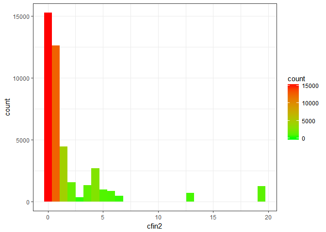
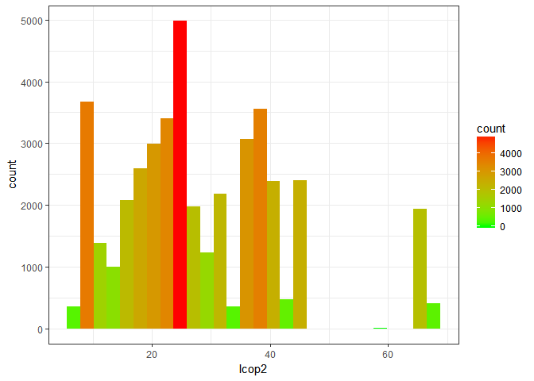
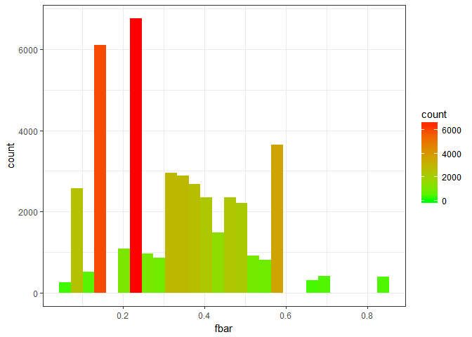
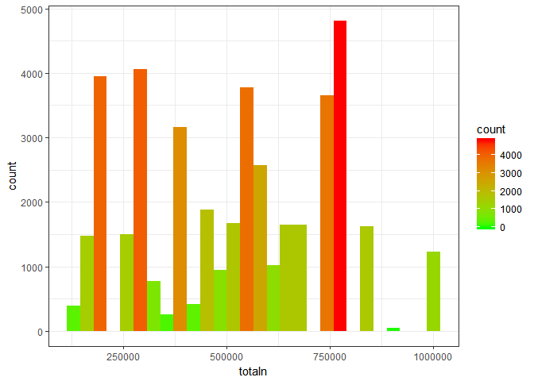
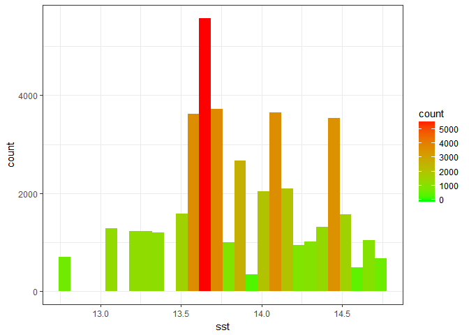

# ZED
Chowanski  
15 grudnia 2016  


## Wykorzystane biblioteki

--------
ggplot2 
dplyr   
cowplot 
--------

## Ładowanie danych
Do wczytania danych z pliku `.csv`, użyto funkcji `read.table`. Ze względu na wystąpienie nagłówka, ustawiono parametr `header = TRUE`, znak separatora został ustawiony na przecinek (`sep=","`). Dodatkowo skorzystano z parametru `na.strings = "?"` w celu zamiany brakujących wartośći (oznaczonych w zbiorze danych znakiem `'?'`) na wartość `NA`.

```r
data <- read.table('./sledzie.csv', header = TRUE, sep=",", na.strings = "?")
```

## Przetwarzanie brakujących danych

Zbiór danych składa się z 52582 rekordów, gdzie 10094 z nich zawiera  wartości `NA`.
Do usunięcia rekordów z brakującymi wartościami użyto funkcji `na.omit()`.

```r
clearData <- data %>% na.omit()
```
Oczyszczony zbiór zawiera 42488 rekordów.

## Rozmiar zbioru i statystki
Zbiór danych po oczyszczeniu zawiera 42488 wierszy oraz 15 kolumn.

####Opis kolumn:
* <span style="color:red; font-weight:bold">length</span>: długość złowionego śledzia [cm];
* cfin1: dostępność planktonu [zagęszczenie Calanus finmarchicus gat. 1];
* cfin2: dostępność planktonu [zagęszczenie Calanus finmarchicus gat. 2];
* chel1: dostępność planktonu [zagęszczenie Calanus helgolandicus gat. 1];
* chel2: dostępność planktonu [zagęszczenie Calanus helgolandicus gat. 2];
* lcop1: dostępność planktonu [zagęszczenie widłonogów gat. 1];
* lcop2: dostępność planktonu [zagęszczenie widłonogów gat. 2];
* fbar: natężenie połowów w regionie [ułamek pozostawionego narybku];
* recr: roczny narybek [liczba śledzi];
* cumf: łączne roczne natężenie połowów w regionie [ułamek pozostawionego narybku];
* totaln: łączna liczba ryb złowionych w ramach połowu [liczba śledzi];
* sst: temperatura przy powierzchni wody [°C];
* sal: poziom zasolenia wody [Knudsen ppt];
* xmonth: miesiąc połowu [numer miesiąca];
* nao: oscylacja północnoatlantycka [mb].

####Statystyki dla zbioru oczyszczonego

         length         cfin1             cfin2             chel1            chel2            lcop1              lcop2             fbar             recr              cumf             totaln             sst             sal             nao         
---  -------------  ----------------  ----------------  ---------------  ---------------  -----------------  ---------------  ---------------  ----------------  ----------------  ----------------  --------------  --------------  -----------------
     Min.   :19.0   Min.   : 0.0000   Min.   : 0.0000   Min.   : 0.000   Min.   : 5.238   Min.   :  0.3074   Min.   : 7.849   Min.   :0.0680   Min.   : 140515   Min.   :0.06833   Min.   : 144137   Min.   :12.77   Min.   :35.40   Min.   :-4.89000 
     1st Qu.:24.0   1st Qu.: 0.0000   1st Qu.: 0.2778   1st Qu.: 2.469   1st Qu.:13.427   1st Qu.:  2.5479   1st Qu.:17.808   1st Qu.:0.2270   1st Qu.: 360061   1st Qu.:0.14809   1st Qu.: 306068   1st Qu.:13.60   1st Qu.:35.51   1st Qu.:-1.90000 
     Median :25.5   Median : 0.1111   Median : 0.7012   Median : 5.750   Median :21.435   Median :  7.0000   Median :24.859   Median :0.3320   Median : 421391   Median :0.23191   Median : 539558   Median :13.86   Median :35.51   Median : 0.20000 
     Mean   :25.3   Mean   : 0.4457   Mean   : 2.0269   Mean   :10.016   Mean   :21.197   Mean   : 12.8386   Mean   :28.396   Mean   :0.3306   Mean   : 519877   Mean   :0.22987   Mean   : 515082   Mean   :13.87   Mean   :35.51   Mean   :-0.09642 
     3rd Qu.:26.5   3rd Qu.: 0.3333   3rd Qu.: 1.7936   3rd Qu.:11.500   3rd Qu.:27.193   3rd Qu.: 21.2315   3rd Qu.:37.232   3rd Qu.:0.4650   3rd Qu.: 724151   3rd Qu.:0.29803   3rd Qu.: 730351   3rd Qu.:14.16   3rd Qu.:35.52   3rd Qu.: 1.63000 
     Max.   :32.5   Max.   :37.6667   Max.   :19.3958   Max.   :75.000   Max.   :57.706   Max.   :115.5833   Max.   :68.736   Max.   :0.8490   Max.   :1565890   Max.   :0.39801   Max.   :1015595   Max.   :14.73   Max.   :35.61   Max.   : 5.08000 

## Rozkład wartości
Na podstawie histogramu wartości `length` można stwierdzić, że rozkład wartości tego atrybutu jest zbliżony do rozkładu normalnego.

```
## [[1]]
```

<!-- -->

```
## 
## [[2]]
```

<!-- -->

```
## 
## [[3]]
```

<!-- -->

```
## 
## [[4]]
```

<!-- -->

```
## 
## [[5]]
```

<!-- -->

```
## 
## [[6]]
```

<!-- -->

```
## 
## [[7]]
```

<!-- -->

```
## 
## [[8]]
```

<!-- -->

```
## 
## [[9]]
```

<!-- -->

```
## 
## [[10]]
```

<!-- -->

```
## 
## [[11]]
```

<!-- -->

```
## 
## [[12]]
```

<!-- -->

```
## 
## [[13]]
```

<!-- -->

```
## 
## [[14]]
```

<!-- -->

```
## 
## [[15]]
```

<!-- -->

## Korelacja między zmiennymi

```
##           X      length       cfin1       cfin2       chel1       chel2 
## -0.33913000  1.00000000  0.08122553  0.09832515  0.22091226 -0.01430766 
##       lcop1       lcop2        fbar        recr        cumf      totaln 
##  0.23775402  0.04894328  0.25697135 -0.01034244  0.01152544  0.09605811 
##         sst         sal      xmonth         nao 
## -0.45167059  0.03223550  0.01371195 -0.25684475
```

```
## `geom_smooth()` using method = 'gam'
```

<!-- -->

```
## `geom_smooth()` using method = 'gam'
```

<!-- -->

```
## `geom_smooth()` using method = 'gam'
```

<!-- -->

```
## `geom_smooth()` using method = 'gam'
```

<!-- -->

```
## `geom_smooth()` using method = 'gam'
```

<!-- -->

## Zmiana rozmiaru śledzia w latach
<video   controls loop><source src="ZED_106629_files/figure-html/animatedChart-.webm" /><p>video of chunk animatedChart</p></video>


